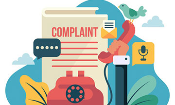

# final_project_ironhack
by [Majed Alqawasmi](https://github.com/MajedAlqawasmi) July 2021
  
## Data Analysis On Consumer Complaint About Banking Products in the U.S

## Table of content

- [Lesson](https://github.com/MajedAlqawasmi/project_midcourse/new/main?readme=1#Lesson)
- [Data](https://github.com/MajedAlqawasmi/project_midcourse/new/main?readme=1#data)
- [Process & Tools](https://github.com/MajedAlqawasmi/project_midcourse/new/main?readme=1#process--tools)
- [Visualization](https://github.com/MajedAlqawasmi/project_midcourse/new/main?readme=1#visualizations)
- [Key Take Aways](https://github.com/MajedAlqawasmi/project_midcourse/new/main?readme=1#key-take-aways)

## Lesson
Important insights derived from deep diving into Global Happiness Index report 2015-2019.

## Data

Two sets of data: [world happiness report 2015-2019](https://www.kaggle.com/unsdsn/world-happiness?select=2015.csv). And [WHO Suicide Statistics](https://www.kaggle.com/szamil/who-suicide-statistics)

## Process & Tools

**Process**
My ways of working included an iterative/agile approach circling through the following steps:

- **Github:** set up our Github repo to collaborate on. We did 104 commits in 4 days.  
- **EDA:** assessment of dataframe to prepare for cleaning 
- **Data cleaning & wrangling in Python:** drop columns, join tables, drop null values, convert float columns to int 
- **Prepocessing:** Normalizer and Dummies 
- **Machine Learning Model:** using scikit learn 
**- iteration 1 (X):** In my first iteration I only used preprocessing and encoding and used this as a benchmark for the following iterations as comparison. I then ran a linear regression model but defining the Yaxis was mot best plus R2 result was way off 

**Tools**
 - **Project management:** [Trello](https://trello.com/b/ktajG50M/project-project)
 - **Jupyter:** [notebook](https://github.com/MajedAlqawasmi/project_midcourse/blob/main/happiness.ipynb)
 - **Cleaning & Wrangling:** Pandas / numpy
 - **Presentation:** [google slides](https://githhttps://docs.google.com/presentation/d/1ftMkQ6WtlwUEWEiUv-6EIyTO_QtbM_HjcW5qTT4T6G4/edit?usp=sharing)
 - **Vizualizations:** seaborn / matplotlib / [Tableau](https://public.tableau.com/views/Happiness_16250058634520/Top5CorrelationDive?:language=en-US&:display_count=n&:origin=viz_share_link)

## Visualizations

For further visualisations please do check out the [repo](https://github.com/MajedAlqawasmi/project_midcourse/tree/main/Visualizations)

## Key Take Aways

### Happiness indexes rely heavily on econimic factors and yes, some external matters such as daily bread, dignity or good health can influence happiness but only till you have “enough” of them.. The correlation is NOT indefinite.
